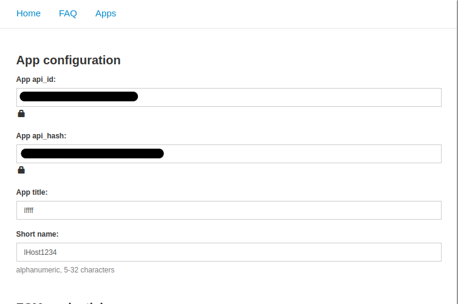
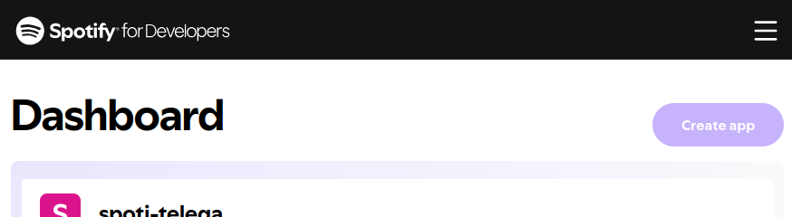
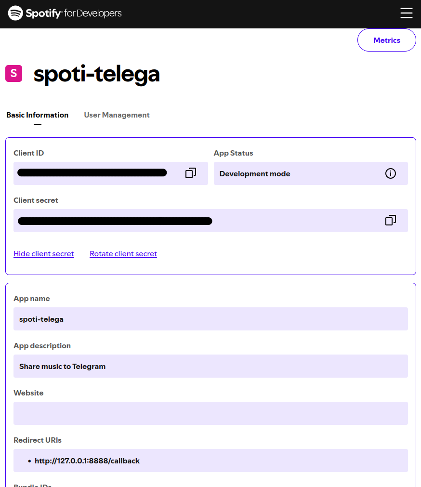

# Spotify-Status-To-Telegram
Этот проект автоматически обновляет ваш статус в Telegram на основе того, что вы сейчас слушаете в Spotify.
Поддерживается как музыка, так и подкасты, с корректным отображением прогресса трека/эпизода.
***
## Требования
Python >= 3.9 
***
## Особенности
- Получение текущего трека из Spotify через официальный API (spotipy).
- Поддержка Telegram через Telethon.
- Автоматическое обновление поля "about" с форматом:
    - Музыка: `ᯤ Spotify | MM:SS | Artist - Track`
    - Подкаст: `ᯤ Spotify is playing a podcast | HH:MM:SS`
- Кроп длинных статусов для обычных и Premium пользователей Telegram.
- Безопасная авторизация через QR-код или сохранённую сессию (host.session).
- Асинхронная архитектура, чтобы не блокировать процесс при запросах к API.

***
# Установка

## Получение API-ключей
> ВАЖНО! Не делитесь своими ключами с другими.
### Telegram


1. Перейдите на [my.telegram.org](https://my.telegram.org/)
2. Авторизуйтесь и нажмите на `API development tools`
3. Создайте приложение и выберите тип веб-приложение


### Spotify
1. Перейдите на [Spotify Dashboard](https://developer.spotify.com/dashboard/)
2. Войдите и создайте новое приложение 
3. После создания приложения зайдите в его настройки нажав на само кнопку с названием с его названием.
4. Поменяйте `Redurect URLs` на `http://127.0.0.1:8888/callback`. 

## Клонирование репозитория
1. Клонируйте репозиторий:
Можете воспользоваться командой ниже или скачайте исходный код из вкладки релизов.
```bash
git clone git@github.com:MegaM15C/Spotify-Status-To-Telegram.git
cd Spotify-Status-To-Telegram

# ИЛИ

git clone https://github.com/MegaM15C/Spotify-Status-To-Telegram.git
cd Spotify-Status-To-Telegram
```

2.  Создайте виртуальное окружение и установите зависимости:

```bash
python3 -m venv .venv
source .venv/bin/activate # Для Windows: .venv\Scripts\activate
pip install -r requirements.txt
```
3. Создайте .env файл в корне проекта с необходимыми переменными, полученными выше:
```ini
TG_API_ID=<ваш Telegram API ID>
TG_API_HASH=<ваш Telegram API Hash>
SPOTIFY_CLIENT_ID=<ваш Spotify Client ID>
SPOTIFY_CLIENT_SECRET=<ваш Spotify Client Secret>
REDIRECT_URL=<ваш Spotify Redirect URL>
SPOTIFY_USERNAME=<ваш Spotify username>
```
# Использование

Запустите скрипт:
```bash
python3 main.py # или python main.py
```
- При первом запуске для Telegram необходимо авторизоваться через QR-код (появится в консоли).
- После успешной авторизации сессия сохраняется в host.session.


# Архитектура 
Архитектура проекта представлена следующим образом:
```ini
├── modules
│   ├── formating_music.py
│   ├── __init__.py
│   ├── spotify.py # инициализация клиента Spotify
│   ├── spotify_time.py
│   └── telegram.py # функции работы с Telegram
├── const.py
├── main.py # основной скрипт запуска и логики обновления статуса.
├── requirements.txt # Необходимые библиотеки pip
├── LICENSE
└── README.md

```

# Ограничения и безопасность
- Spotify API ограничивает частоту запросов — текущий интервал обновления выбран с запасом.
- Никогда не коммитьте файлы сессий или токены в публичные репозитории (`host.session`, `.cache-*`).

# Лицензия

[MIT License](LICENSE)